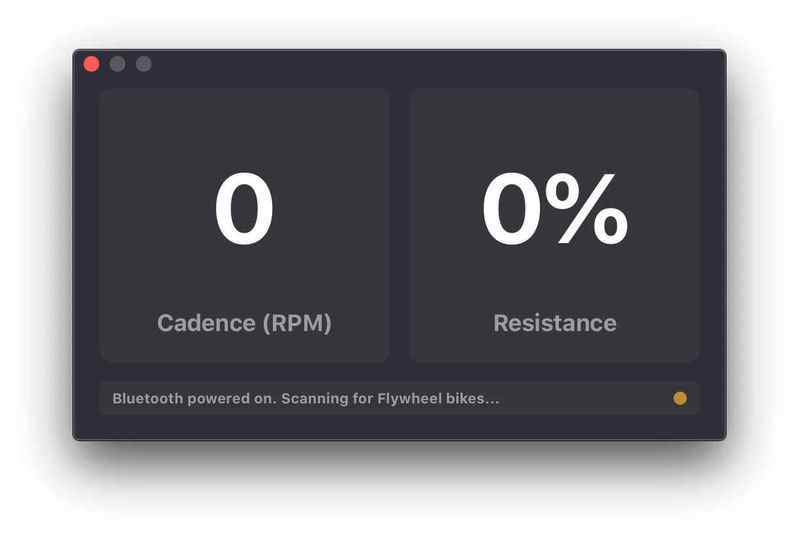

# Derailleur
### ***de·rail·leur:** (noun) a bicycle mechanism that moves the chain out and up, allowing it to shift to different cogs.* :bicyclist:
---
A macOS app (for now) built to display the data from Flywheel at Home bikes without screens. As a result of the Peloton/Flywheel lawsuit, all Flywheel at Home workouts were stopped at the end of March 2020. Due to COVID-19, some (including myself) have been left with a Flywheel at Home bike that no longer has its companion mobile app, while waiting for Peloton replacements to be delivered.

I created this app to give new life to the Flywheel bike taking up a large amount of space in my tiny San Francisco apartment.

# Okay, how do I use it?

If you want to tinker with the code, go forth and do so. Otherwise, head to Releases and download the latest stable release.

Just start the app and it will automatically look for your Flywheel bike - make sure your Bluetooth is turned on and you've turned the pedals to activate the Bluetooth in the bike. If you've never used your Flywheel bike before, make sure you have inserted the batteries in the compartment by the pedals - the Bluetooth is actually powered by these batteries and not the AC adapter.

# If you have any issues...
Please create a new issue and describe the problem. I've shied away from Objective-C for a long time, but the long lockdown nights gave me some spare time to throw this together. It may not work perfectly for you.